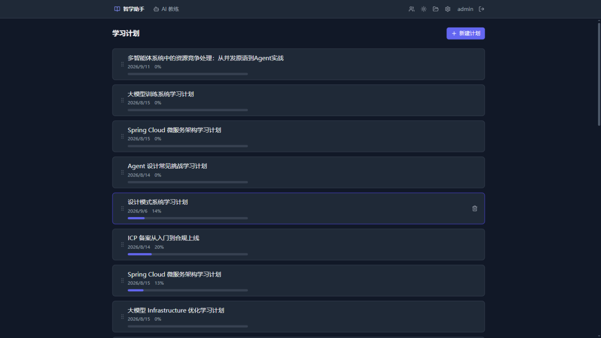
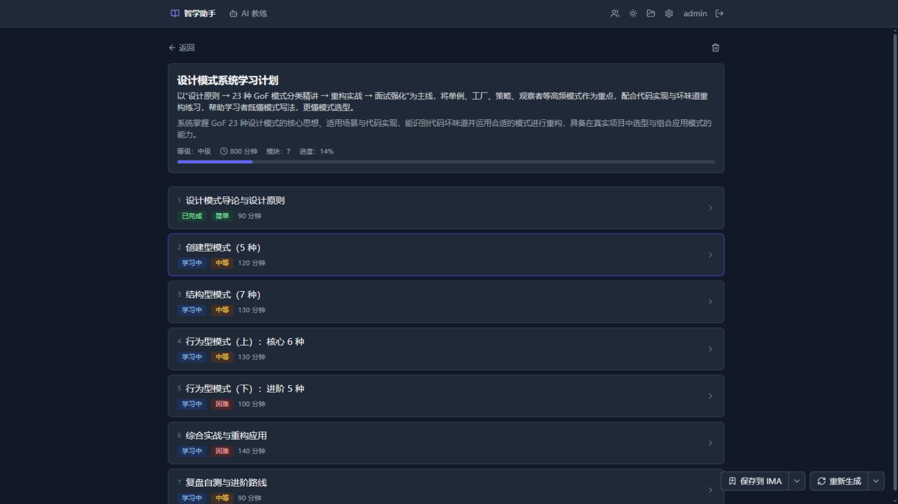
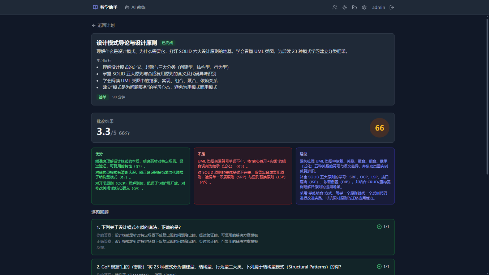
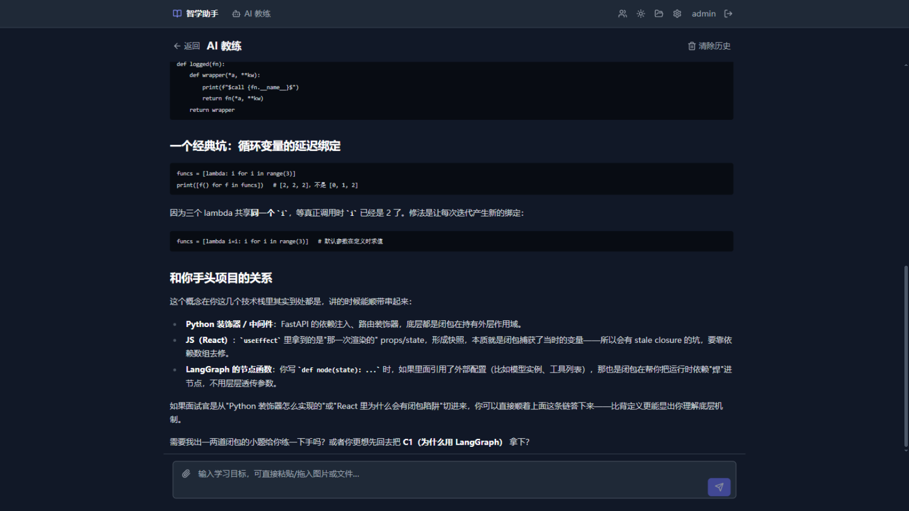

# 智学助手 zhixue

AI 学习助手全栈系统：输入一个学习主题（或上传学习资料），自动生成结构化学习计划、逐模块产出学习内容与测验、批改作答，并配有一个能记住学员的 AI 教练。网页端 + Android App 双端可用。

## 功能特性

- **学习计划生成**：按主题或学习资料生成多模块结构化计划（目标/摘要/难度/时长），模块进度跟踪、内容手工编辑、四种重新生成策略
- **学习资料上传 + 全模态转写**：图片 / PDF / Word / 文本（≤50MB），上传即出缩略图、点开看原件；提交时由多模态模型把文件转写成文字（两段式：全模态理解 → 现有文本链路），同文件按 SHA-256 自动复用解析结果
- **AI 教练对话**：流式对话 + 工具调用（创建计划/搜索计划/存档）；支持附件（粘贴、拖入、📎）；长期记忆（Mem0 + pgvector，含分类/重要性/夜间整理）与学生画像；短期记忆滚动摘要
- **测验与批改**：单选/多选/简答，SSE 流式生成，AI 批改 + 学习建议
- **邀请制注册**：管理员生成邀请码/邀请链接，新用户凭码自助建号；不开放自注册
- **多用户**：账号密码 + 双 token（JWT access + 轮换 refresh），数据按用户隔离；管理员用户管理
- **模型配置**：每个用户自带大模型 / 向量模型 / 多模态模型配置（OpenAI 兼容接口，Key 加密存储），token 用量按模型类型统计
- **移动端**：Capacitor Android 打包，与网页端同源功能

## 界面预览

| 登录页 | 学习计划列表 |
|---|---|
|  |  |

| 计划详情与模块进度 | AI 批改与逐题回顾 |
|---|---|
|  |  |

AI 教练：能记住你的学习上下文，讲解直指你正在学的技术栈。



## 技术栈

| 层 | 技术 |
|---|---|
| 前端 | React 19 + TypeScript + Vite + Tailwind CSS + TanStack Query + react-router |
| 后端 | Python 3.12 + FastAPI + LangChain / LangGraph + DeepAgents（计划/测验/批改子代理） |
| 数据库 | PostgreSQL 16 + pgvector（Mem0 长期记忆向量检索） |
| 部署 | Docker Compose（nginx + FastAPI 单容器托管 API 与前端静态产物），HTTP 直连 |
| 移动端 | Capacitor 6（Android），复用网页前端 |

## 目录结构

```
frontend/          React 网页端
backend/           FastAPI 后端（app/ 按域拆分；db/schema.sql 建表）
mobile/            Capacitor Android 壳（打包见 mobile/APP打包指南.md）
nginx/             nginx 配置（HTTP，/api 反代支持 SSE 流式）
scripts/deploy.sh  一键部署脚本
docs/              记忆系统方案、移动端方案等设计文档
DEPLOY.md          部署详细说明（架构、首次准备、备份、故障排查）
```

## 快速部署

详细说明（架构图、备份/回滚、App 打包、常见故障）见 [DEPLOY.md](DEPLOY.md)。

**要求**：Linux 服务器 + Docker Compose v2 + git。部署形态为纯 HTTP、IP 直连（无域名/证书）。

```bash
# 1. 拉代码 & 写配置（部署分支 test-deploy，只含测试环境部署逻辑）
sudo git clone -b test-deploy git@github.com:pengliuah/zhixue.git /opt/zhixue
cd /opt/zhixue
sudo cp deploy.env.example .env
sudo vi .env    # 设置 POSTGRES_PASSWORD / JWT_SECRET / ADMIN_PASSWORD

# 2. 一键部署
sudo bash scripts/deploy.sh

# 3. 访问 http://<服务器IP>/ 用 .env 里的管理员账号登录
```

部署脚本每次会自动：备份数据库与附件目录 → git reset 到本分支远端最新 → 构建镜像 → 迁移数据库（幂等）→ 健康检查。**模型 API Key 不需要在服务器配置**——部署完成后每个用户登录，在网页「模型设置」页填自己的 Key（存库、加密）。

首次部署后建议：管理员登录 → 「用户管理」生成邀请码发给学员 → 学员自助注册。

## 模型配置

系统不内置任何模型服务：**每个用户登录后，在网页「模型设置」页配置自己的模型**（配置按用户存数据库，API Key 加密存储，不上传到任何第三方）。所有模型均支持 OpenAI 兼容接口（火山方舟、阿里百炼 DashScope、DeepSeek、OpenAI 及各类兼容网关均可）。

「模型设置」页共三个分区：

| 分区 | 用途 | 必填项 | 说明 |
|---|---|---|---|
| **大模型配置** | 计划生成 / 内容 / 测验 / 批改 / AI 教练对话 | API Key、模型名 | Base URL 填服务商的 OpenAI 兼容地址（如火山方舟 `https://ark.cn-beijing.volces.com/api/v3`、百炼 `https://dashscope.aliyuncs.com/compatible-mode/v1`）；最大输出 Token 控制单次回答长度，内容较长时建议调大（16384/32768） |
| **向量模型配置** | 长期记忆的检索向量化（AI 教练记住学员） | 模型名 | API Key / Base URL **留空时自动复用大模型的对应值**（同一服务商下常见），单独使用别的嵌入服务才需要填 |
| **多模态模型配置** | 学习资料附件解析（图片/PDF → 文字转写） | 模型名 | 同样留空回退大模型——**主模型本身就是全模态模型**（如 qwen-omni 系列）时无需再配；否则填一个支持视觉的模型（如 `qwen-vl-max`、`qwen-omni-turbo`） |

几点说明：

- 未配置大模型 Key 时，所有 AI 生成功能返回 503，页面顶部会有黄色提示，配好即恢复；
- 三类配置互不影响，可以只配大模型（此时附件解析走文本文件 + 多模态回退逻辑），也可以三个用不同服务商；
- 「Token 用量」卡片按模型类型分三档（大模型 / 嵌入模型 / 多模态）统计今日、本月、累计消耗，方便对照各服务商控制台账单；
- 换模型 / 换 Key 即存即生效，无需重启服务。

## 本地开发

```bash
# 后端（Python 3.12 + uv）
cd backend
uv sync --extra test
uv run uvicorn app.main:app --reload --port 8000
# 需要本地 PostgreSQL（或直接连测试库），DATABASE_URL 写在 backend/.env

# 前端
cd frontend
npm install
npm run dev        # 默认代理 /api 到 localhost:8000

# 测试
cd backend  && uv run --extra test pytest      # 186 项（需测试库可达，自动指向 zhixue_test）
cd frontend && npm test                        # 32 项

# Android 打包（详见 mobile/APP打包指南.md）
cd mobile && npm run dev:apk    # 产出 mobile/zhixue-debug.apk
```

## 说明

- 用户数据（计划、测验、记忆、模型 Key、附件）全部按账号隔离；附件原始文件存服务器文件卷（`./data/attachments`），转写文本存数据库
- 学习资料解析等 AI 功能按各用户自己配置的模型计费消耗，本系统不做转售

## License

仅供学习交流使用。
